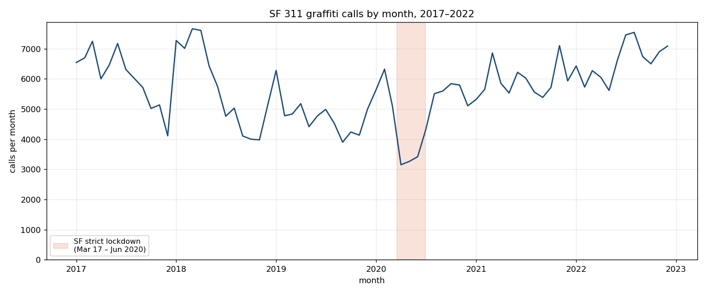
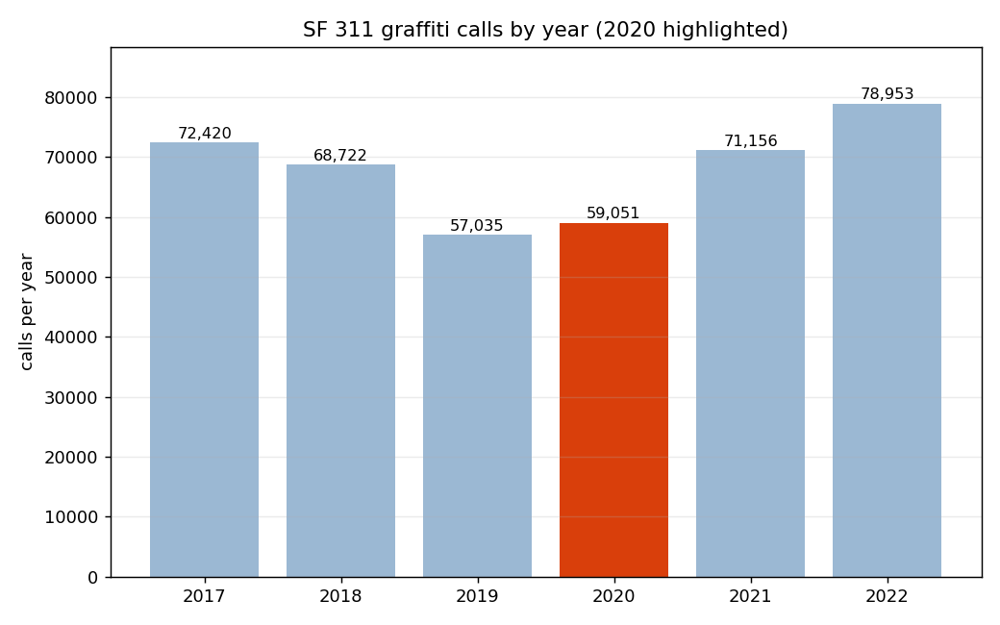
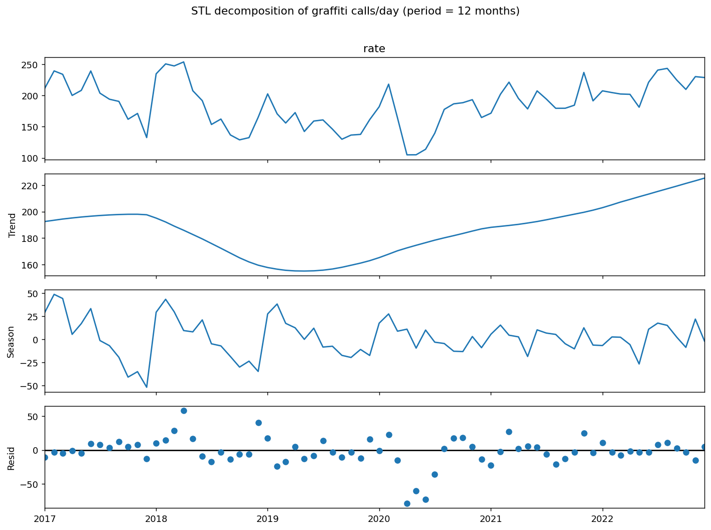
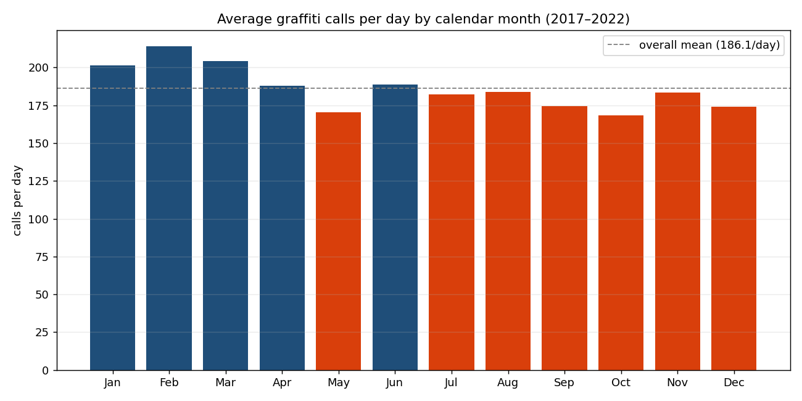
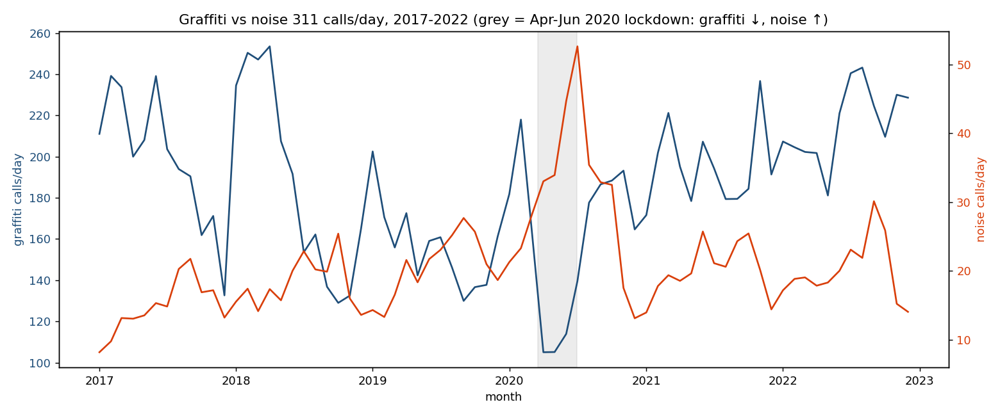

# SF 311 Graffiti & COVID

San Francisco 311 service-request data used to evaluate one hypothesis:

> **Did graffiti calls decrease in 2020 as a result of COVID?**

Data source: [DataSF "311 Cases"](https://data.sfgov.org/City-Infrastructure/311-Cases/vw6y-z8j6),
Socrata dataset `vw6y-z8j6`. Graffiti requests are identified by `service_name` in
(`Graffiti`, `Graffiti Public`, `Graffiti Private`). This project analyzes calls from **2017–2022**.

## Findings

**Short answer: nuanced — yes for the lockdown, no for the year.**

Graffiti calls fell sharply during San Francisco's strict spring-2020 shelter-in-place, but
rebounded so strongly afterward that the full-year total ended *above* 2019.

| Window | 2020 | 2019 | Change |
|---|---|---|---|
| **Apr–Jun** (strict lockdown) | 9,828 | 14,362 | **−31.6%** |
| **Jul–Dec** (rebound) | 32,174 | 26,785 | **+20.1%** |
| **Full year** | 59,051 | 57,035 | **+3.5%** |



The shaded lockdown window (Mar 17 – Jun 2020) is the deepest trough in the entire 2017–2022
series — calls dropped to ~3,150/month, well below the usual 4,500–6,500 — then recovered to
above-2019 levels by late 2020.



**Conclusion:** COVID produced a clear but *short-lived* decline in graffiti 311 calls during the
strict lockdown; it did **not** reduce the full-year total. So the hypothesis holds only for the
lockdown window, not for 2020 as a whole.

**Caveat:** 311 counts measure *reports*, not graffiti *incidence*. With far fewer people out during
the strict lockdown, the drop plausibly reflects reduced **reporting** (and less-frequented public
space) rather than less graffiti being created. These data show *when* calls fell, not *why*.

## Seasonality

**Short answer: yes, but it's modest.** Graffiti reporting has a mild repeating within-year cycle —
higher in late winter/early spring, lower in fall — but it is weak relative to the multi-year trend
and the COVID shock. (`scripts/seasonality.py`; monthly series analyzed as **calls per day** to
remove the 28–31-day month-length artifact, with the Apr–Jun 2020 lockdown controlled for.)

Three lenses, deliberately triangulated because they can disagree:

| Method | Result | Reading |
|---|---|---|
| STL decomposition (period 12) | seasonal strength **F_S ≈ 0.48** | moderate |
| Calendar-month profile | peak **Feb** (214/day), trough **Oct** (168/day), **1.27×** | clear shape |
| OLS two-way ANOVA (year FE + month dummies) | F = 1.72, **p ≈ 0.09** | month block *not* significant at 0.05 |
| SARIMA(1,0,0)(1,0,0)₁₂ + trend + lockdown | seasonal AR₁₂ = 0.29, **p ≈ 0.03**, ΔAIC **+2.6** | seasonal term significant but weak |





**Why the tests disagree, and what's honest:** the trend is **U-shaped** (high 2017 → trough 2019 →
rising through 2022), so a naive *linear* trend misspecifies it and both masks seasonality (OLS) and
lets a seasonal term soak up trend (SARIMA). Using **year fixed effects** in the OLS and a **trend +
convergent, stationarity-constrained** SARIMA fixes this — an earlier non-convergent SARIMA reported a
spurious ΔAIC of ~127, which we discarded. The reconciled verdict: seasonality is **real but weak** —
the single seasonal parameter is significant (p≈0.03) while the month block is only borderline
(p≈0.09). Trend and COVID explain more of the variation than season does.

## Noise complaints & the graffiti–noise relationship

Extends the analysis to **noise** 311 complaints (`service_name like '%Noise%'`, 45,440 records
2017–2022) and asks whether noise and graffiti move together. (`scripts/noise_analysis.py`.)

**COVID hit the two in opposite directions.** During the Apr–Jun 2020 lockdown, graffiti calls fell
**−31.6%** vs 2019 while noise calls **rose +81.2%** — and for the full year noise was **+49.4%** vs
graffiti's +3.5%. Stuck-at-home life meant fewer people out to notice/report street graffiti but far
more friction with neighbors' noise.



**They are inversely related, not just during COVID.** The monthly per-day rates are negatively
correlated — Pearson **r = −0.43** raw, **−0.45** after removing each series' trend and 12-month
seasonality (STL remainders), and still **−0.27** with 2020 excluded. So the inverse pattern is modest
but real and survives dropping the pandemic year. A plausible common driver — how much time people
spend outside vs at home — is exactly what the weather experiment below probes.

## Reproduce

```bash
pip install -r requirements.txt
python scripts/download_data.py     # all categories -> data/raw/sf311_<cat>_2017_2022_<date>.csv
python scripts/analyze.py           # -> data/processed/*.csv, figures/*.png (COVID question)
python scripts/seasonality.py       # -> STL + SARIMA seasonality analysis, figures
jupyter notebook notebooks/graffiti_covid.ipynb
```

An optional DataSF app token avoids API throttling: `export SODA_APP_TOKEN=...`

## Layout

```
data/raw/          NOT committed — regenerate with download_data.py (git-ignored)
data/processed/    aggregated monthly/yearly counts (committed)
scripts/           download_data.py, analyze.py
notebooks/         graffiti_covid.ipynb (narrative)
figures/           generated plots
```

**Raw data is not stored in git.** It is fully regenerable from DataSF (`vw6y-z8j6`) — run
`python scripts/download_data.py` to recreate `data/raw/sf311_graffiti_2017_2022_<date>.csv`
before running the analysis. This keeps the repo lean (git already compresses the CSV, so there's
nothing to gain by committing or zipping it) and treats DataSF as the authoritative source.

## Notes on the data

- 311 counts measure **reports**, not graffiti incidence. A drop in calls can reflect fewer people
  out reporting rather than less graffiti — an important caveat for the COVID question.
- Analysis starts in 2017 to avoid the 2008–2012 reporting ramp-up (mobile/Open311 adoption) that
  distorts long-run trend comparisons.
